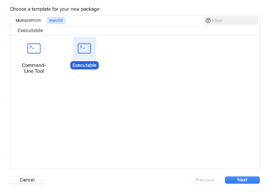

# Swift Macros for Raycast Extensions

This Swift Package contains code generation macros and plugins to build a communication chanel between [Raycast](https://raycast.com)'s React extensions and Swift native code. Basically, it lets you import Swift code into your Raycast extension in order to:
- leverage native macOS APIs that might not be exposed to TS/JS, or
- use Swift for targeted sections of your extension, letting you use all Swift language features (such as result builders, async/await, generics/existentials, etc.), or
- compartmentalize your extension into client-facing code (react) and system code (swift).

### Requirements

- An editor to write Swift (e.g. VSCode, Xcode).
- The Swift toolchain (comes pre-installed with Xcode, or download it from [Swift.org](https://www.swift.org/download/), or through [VScode's Swift extension](https://marketplace.visualstudio.com/items?itemName=sswg.swift-lang)).

## Using the Package

1. Create (or fork) a Raycast extension.

    If you don't know how, check out [this guide](https://developers.raycast.com/basics/create-your-first-extension).

2. Create a Swift executable target in the folder of your Raycast extension.

   <p>You can create the target in any of the following ways:
   <details><summary>using Xcode, or</summary>
   <p></p>
   <ul>
   <li>Open Xcode</li>
   <li><code>File > New > Package...</code> to create a new Swift package</li>
   <li>Select `Executable`</li>
   <li>Select the place within the Raycast extension package you want</li>
   <li>Untick the "Create Git repository on my Mac"
      <p>I like to put it in a `swift` folder next to the existing `src` folder.</p>
   </li>

    
    
   </p>
   </details>
   <details><summary>using the <code>swift package</code> command in the terminal or VSCode.</summary>
   <p></p>
   <p>
   Simply run <code>swift package init --type executable --name CustomName</code> in the Raycast extension folder. In the previous line of code `CustomName` references the name for the Swift Package. You can name this whatever you want.
   </p>
   </details>
   </p>

3. Modify the `Package.swift` file to include the necessary macros and build plugins.

    ```diff
    // swift-tools-version: 5.9

    import PackageDescription

    let package = Package(
        name: "CustomName",
    +    platforms: [
    +      .macOS(.v12)
    +    ],
    +    dependencies: [
    +      .package(url: "https://github.com/raycast/raycast-extension-macro", from: "1.0.0")
    +    ],
        targets: [
          .executableTarget(
            name: "CustomName",
    +       dependencies: [
    +         .product(name: "RaycastSwiftMacros", package: "raycast-extension-macro"),
    +         .product(name: "RaycastSwiftPlugin", package: "raycast-extension-macro"),
    +         .product(name: "RaycastTypeScriptPlugin", package: "raycast-extension-macro"),
    +       ]
          ),
        ]
    )
    ```

4. Write a global Swift function and mark it with the `@raycast` attribute.
